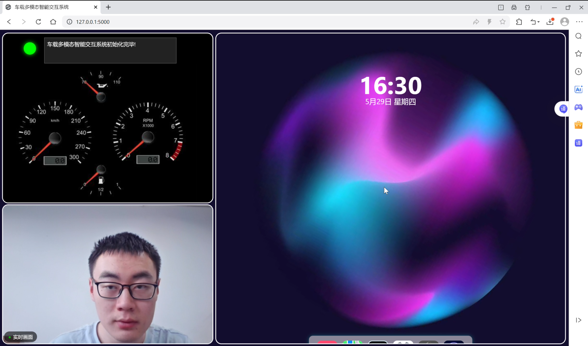

# 智能驾驶舱系统

## 环境配置

### 系统要求

- Python 3.12
- CUDA (GPU加速，可选)
- Windows 10/11

### 安装步骤

1. **克隆仓库**

```bash
   git clone https://github.com/CentaureaHO/NKU_SoftwareEngineering.git
   cd NKU_SoftwareEngineering
```

2. **创建并激活conda环境**

```bash
   conda create -n smart_cab python=3.12
   conda activate smart_cab
```

3. **安装依赖**

```bash
   pip install -r requirements.txt
```

4. **安装PyTorch**

   使用GPU加速(CUDA 12.6):

```bash
   pip install torch torchvision torchaudio --index-url https://download.pytorch.org/whl/cu126
```

   或使用CPU版本:

```bash
   pip install torch torchvision torchaudio
```

5. **安装ModelScope**

   仅需要音频部分，使用：

```bash
   pip install modelscope[audio] -f https://modelscope.oss-cn-beijing.aliyuncs.com/releases/repo.html
```
6. **安装Kokoro Zh**

   用于语音合成的Kokoro库的中文语音合成需额外安装：

```bash
   pip install misaki[zh]
```

7. **启动项目**

```bash
   python main.py
```

### 系统使用说明
本系统采用多模态交互机制，结合语音、手势与头部姿态，实现智能驾驶舱的人机协作。在启动阶段，驾驶员需根据左上角提示框的引导，将视线保持居中 3 秒钟，以完成身份确认与系统激活。系统启动后，用户将看到多模态交互选项提示，可选择是否进行车辆状态监测、导航或音乐播放。

在确认操作意图时，用户可使用语音、手势或头部动作进行自然交互。例如，若用户希望开启导航功能，可通过语音输入 “同意导航”，或使用竖起大拇指、点头等动作进行确认；若希望拒绝，则可通过语音输入 “拒绝导航“，或摇手、摇头等方式表达拒绝。

系统还支持细粒度的权限和配置操作。点击界面上的 “权限按钮”，可进入权限管理界面，设置访问权限与操作范围。点击 “设置按钮”，则可进入多模态个性化配置页面，调整不同模态对应的功能，以适应不同驾驶员的使用偏好，例如将握拳对应的功能从导航变成播放音乐。

此外，用户可直接点击 “车辆监测按钮“，启动车辆状态感知模块，对车况进行实时监控；点击 “地图按钮“，可进入导航系统，设定路线并进行导航；点击 “音乐按钮“，可开启或暂停音乐播放，提供更丰富的车内娱乐体验。

更多使用细节可以观看Demo文件夹下的相关视频

 

